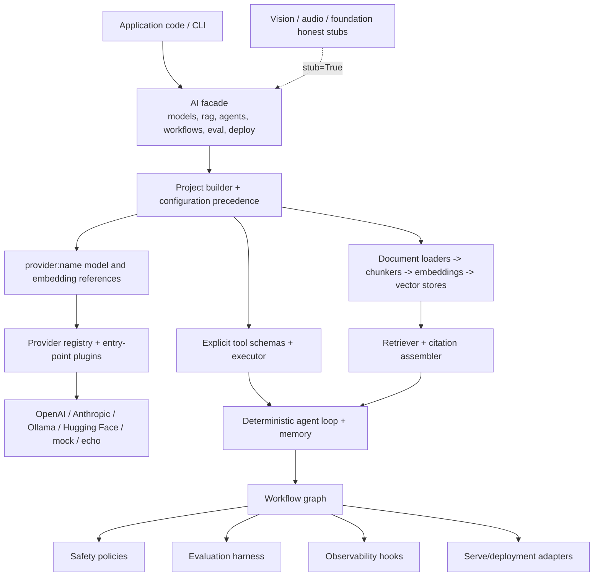
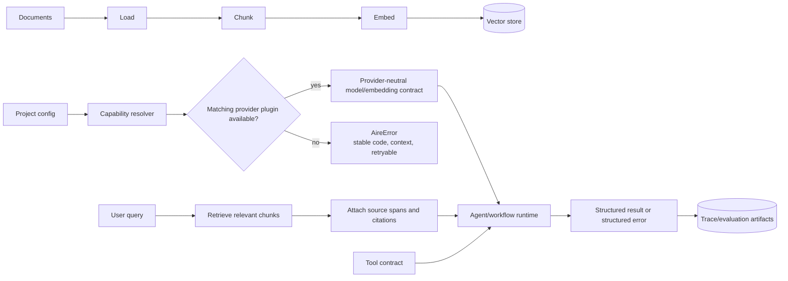
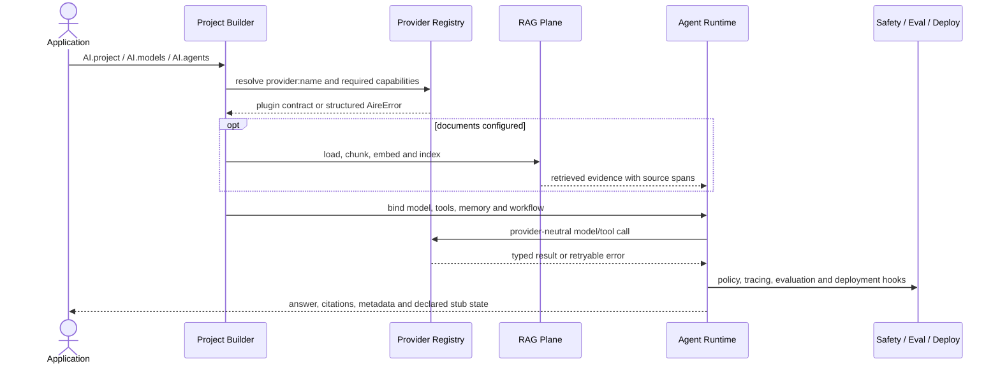

# aire

**Agent-first AI creation library** (Apache-2.0, Python 3.11+) — one consistent
interface from a local prototype to a deployed system: models, data, RAG,
agents, tools, workflows, evaluation, safety, observability, and deployment.

> **Status: Alpha (`0.3.x`).** APIs can change. Some surfaces (vision, audio,
> foundation helpers) are intentionally stubby — check return flags / `.describe()`
> rather than assuming production-ready multimodal or pretrained weights.

```python
from aire import AI

assistant = (
    AI.project("knowledge_assistant")
    .documents("./docs")
    .model("mock:echo")  # or openai:gpt-4o-mini, ollama:llama3.2, anthropic:claude-sonnet-4-5
    .vector_store("local:default")
    .citations(True)
)

assistant.index()
answer = assistant.ask("What does the documentation say about authentication?")
print(answer.text)
print(answer.citations)
```

**Works offline out of the box** (`mock:echo` + `local:hashing`) — no API keys,
no network. Swap providers with a one-string change.

---

## Install

```bash
pip install aire-ai
# import name stays `aire`:
#   from aire import AI
#
# or from source
pip install -e ".[dev]"
```

> **Note:** The PyPI distribution is named **`aire-ai`** because the name `aire`
> is already taken by an unrelated package. The Python import remains `aire`.

Optional extras: `serve`, `ml`, `vision`, `training`, `eval`, `docs`, provider-named extras, and
`all`. See `pyproject.toml`.

Requires **Python 3.11+**.

---

## Quick start (offline)

```python
from aire import AI

model = AI.models.use_sync("mock:echo")
result = model.generate_sync("hello, aire")
print(result.text)

# Knowledge assistant / RAG without credentials
assistant = AI.project("demo").documents("./docs").model("mock:echo")
assistant.index()
print(assistant.ask("Summarize the project.").text)
```

CLI:

```bash
aire doctor
aire run "hello, aire"
```

Runnable samples live under [`examples/`](examples/).

---

## Core ideas

| Idea | What it means |
|------|----------------|
| Agent-first | Discoverable components (`.describe()`), tools as contracts, deterministic agent runtime |
| Provider-independent | `provider:name` refs (`openai:…`, `anthropic:…`, `ollama:…`, `mock:echo`) via plugins |
| Offline-capable | Full local loop with `mock:echo` / `local:hashing` |
| Structured errors | `AireError` subclasses with stable `code`, `context`, `retryable` |
| Composable facade | `AI.models`, `AI.rag`, `AI.agents`, `AI.workflows`, `AI.eval`, `AI.deploy`, … |

---

## Honesty about stubs

aire prefers **honest stubs** over silent fakes:

- **Vision / audio** — pipelines may return `stub=True` when no real media provider is configured.
- **Foundation / training helpers** — config-driven toy stacks and hooks; not pretrained weight downloads by default.
- **Some builtins / toolkits** — still thin; read `.describe()` and docs before relying on them in production.

See [`docs/`](docs/) (especially honesty / guide pages as they land) and [`GAPS.md`](GAPS.md)
for the rebuild backlog.

---

## Documentation

| Resource | Link |
|----------|------|
| Docs home | [`docs/`](docs/) |
| Changelog | [`CHANGELOG.md`](CHANGELOG.md) |
| Contributing | [`CONTRIBUTING.md`](CONTRIBUTING.md) |
| Security | [`SECURITY.md`](SECURITY.md) |
| Code of conduct | [`CODE_OF_CONDUCT.md`](CODE_OF_CONDUCT.md) |
| Cite | [`CITATION.cff`](CITATION.cff) |

---

## Development

```bash
make install      # pip install -e ".[dev]"
make lint         # ruff check + format --check
make typecheck    # mypy
make test         # pytest -q
make all          # lint + typecheck + test
pre-commit install
```

CI runs on Python 3.11–3.13. See [Contributing](CONTRIBUTING.md).

---

## Providers

First-party provider entry points: `openai`, `anthropic`, `ollama`, `huggingface`,
`mock`, `echo`. Additional OpenAI-compatible aliases and vector stores are
available via integrations — see docs and `aire.integrations`.

---

## License

Apache License 2.0 — see [`LICENSE`](LICENSE).

<!-- architecture-atlas-v5:start -->
## Architecture Atlas v5

These editable Mermaid diagrams mirror the [Notion architecture dossier](https://app.notion.com/p/3b467342e8c18175aaefc8ed5958d1fe?pvs=204).

### 1. Capability planes



### 2. Provider and RAG wiring



### 3. Runtime narrative



### 4. Reliability model

```mermaid
stateDiagram-v2
  [*] --> CONFIGURED
  CONFIGURED --> PROVIDER_RESOLVED
  PROVIDER_RESOLVED --> INDEXING: knowledge project
  PROVIDER_RESOLVED --> READY: model-only project
  INDEXING --> READY
  READY --> RUNNING_AGENT
  RUNNING_AGENT --> CALLING_TOOL
  RUNNING_AGENT --> CALLING_MODEL
  CALLING_TOOL --> RUNNING_AGENT
  CALLING_MODEL --> RUNNING_AGENT
  RUNNING_AGENT --> EVALUATING --> DEPLOYED
  CONFIGURED --> DEGRADED_STUB: explicitly selected or missing real media provider
```

<!-- architecture-atlas-v5:end -->
