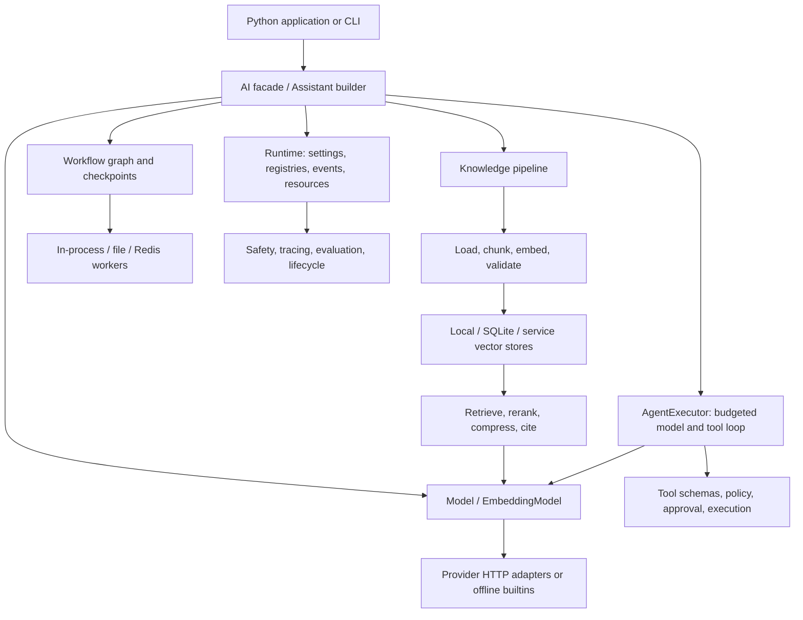

# aire

**A Python library for composing models, retrieval, tools, agents, and workflows.**
One `AI` facade exposes the components; lower-level classes let you replace them
individually. Apache-2.0 · Python 3.11+ · distribution: **`aire-ai`** · import: **`aire`**.

**Alpha, 0.3.x.** Start with the offline defaults, test your chosen adapters, and
read the [limitations](#limitations) before using it for production workloads.
The echo model tests plumbing; it does not reason or answer questions intelligently.

```python
from aire import AI

assistant = (
    AI.project("handbook")
    .documents(["Access requires a short lived token and an authorized role."])
    .model("mock:echo")
    .embedder("local:hashing")
    .citations(True)
)
report = assistant.index()
answer = assistant.ask("How does access work?")
print(report.documents, report.chunks)
print(answer.text)       # Echoes the assembled retrieval prompt, including context.
print(answer.citations)  # Structured references to retrieved chunks.
```

This example uses no credentials, model downloads, or network services. With the
package installed, it runs as written. The same pipeline can use a hosted model
or a local inference server by changing the model reference.

## Install and develop

```bash
python -m pip install aire-ai
```

The PyPI name `aire` belongs to a different project. Install **`aire-ai`**.
To work on this source tree, including the reliability changes described below:

```bash
git clone https://github.com/desenyon/aire.git
cd aire
python3.13 -m venv .venv
source .venv/bin/activate             # Windows: .venv\Scripts\activate
python -m pip install -e '.[dev,docs]' build
python examples/reliable_local/main.py
```

The last command is an offline integration smoke test. It exercises SQLite
persistence, document replacement, retrieval with citations, a scripted tool
call, an agent session, a file-queue job, and workflow resume in a temporary
directory that is cleaned up afterward.

| Extra | Purpose |
| --- | --- |
| `dev` | Ruff, mypy, pytest/coverage, type stubs, FastAPI and Uvicorn for tests |
| `docs` | MkDocs, Material theme, Python API documentation |
| `serve` | FastAPI and Uvicorn |
| `ml`, `numpy`, `polars` | Optional estimator/data ecosystems |
| `torch`, `keras`, `training`, `peft` | Optional neural network/training backends |
| `pgvector`, `neo4j`, `redis` | Optional service clients; services remain your responsibility |
| `vision`, `pypdf`, `ocr`, `eval` | Image/PDF/OCR/evaluation integrations; some require external models or binaries |

Provider-named extras such as `openai`, `anthropic`, and `ollama` add no vendor
SDK: these adapters use the core `httpx` dependency. `all` installs many heavy
optional packages; it is unnecessary for agents, local RAG, or the default tests.
The complete list is in [pyproject.toml](pyproject.toml).

## Architecture



There are three useful entry levels:

1. **Project builder:** `AI.project(...).documents(...).model(...)`, followed by
   `index()`, `ask()`, `evaluate()`, or `deploy()`.
2. **Composable facade:** `AI.models`, `AI.rag`, `AI.agents`, `AI.workflows`,
   `AI.workers`, `AI.gateway`, and the other namespaces exposed by `AI.describe()`.
3. **Direct components:** instantiate `Runtime`, `Knowledge`, `Agent`, `Workflow`,
   or provider/store classes when you need explicit dependency ownership.

`Runtime` owns settings, registries, provider plugins, event dispatch, and
registered HTTP resources. The facade creates a process-wide runtime lazily.
Use an explicitly owned runtime for isolation, and close it with
`await runtime.aclose()` or `async with Runtime(...)`. Close directly created
SQLite stores with `await store.aclose()`.

| Source package | Responsibility |
| --- | --- |
| `core` | Normalized content/tool calls, configuration, errors, serialization, lifecycle |
| `models`, `integrations` | Model contracts, provider resolution, HTTP payload conversion, stream assembly |
| `data`, `rag` | Loading/chunking, embeddings, indexes, hybrid retrieval, ACL filters, citations |
| `agents`, `tools` | Agent state machine, memory/sessions, tool contracts, permissions and approvals |
| `workflows`, `workers` | Graph execution, persisted scheduling, local/distributed queue transports |
| `safety`, `evaluation`, `observability` | Guardrails, metrics/gates, traces and exporters |
| `deployment`, `mcp` | FastAPI/gateway adapters, generated deployment files, MCP subset |
| `ml`, `training`, `audio`, `vision`, `graph` | Optional and experimental subsystems; see their capability descriptions |

The [architecture guide](docs/ARCHITECTURE.md) and [public API map](docs/PUBLIC_API.md)
provide more detail. These are composable systems: configuring a workflow does
not automatically deploy it, attach tracing, or run evaluations.

## Models and streaming

```python
import asyncio
from aire import AI
from aire.models.types import GenerationRequest

async def main():
    model = await AI.models.use("mock:echo")
    print(await model.ask("Hello, aire"))
    async for chunk in model.stream(GenerationRequest.of("Stream this text")):
        print(chunk.text, end="")
    await AI.runtime().aclose()

asyncio.run(main())
```

Use `await` APIs inside notebooks, web handlers, and existing event loops.
`*_sync` methods and `aire.models.base.run_sync()` are conveniences for synchronous
programs; they cannot be called inside an active event loop. The low-level model
contract is `generate(GenerationRequest)`, `stream(...)`, `info`, and `health()`.

References have the form `provider:name`. Builtins include `mock:echo`,
`local:hashing` for embeddings, and registered `callable:<name>` models. HTTP
providers include OpenAI, Anthropic, Ollama, Hugging Face and OpenAI-compatible
aliases. Provider capabilities differ; a shared interface does not imply every
model supports tools, structured output, media, or identical token accounting.

```python
from aire import AI

# Select a model available to your provider account / local server.
# These calls require the corresponding server or credentials when used.
model = AI.models.use_sync("openai:gpt-4o-mini")
local_model = AI.models.use_sync("ollama:llama3.2")
```

`Message.tool_calls` preserves assistant declarations alongside tool-result
messages and their `tool_call_id`. The existing import
`from aire.models.types import ToolCall` remains valid. `GenerationResult.message`
produces a complete assistant message, suitable for the next model request.

OpenAI-compatible streams buffer argument fragments by call index and emit each
complete call once at the finish event. Anthropic streams assemble tool blocks
and emit them when the block closes. Both preserve usage and finish reasons;
malformed or unfinished tool arguments raise structured `ProviderError` rather
than becoming an executable partial call. Ollama emits complete tool calls from
its JSON stream. Models without native streaming use a one-chunk fallback that
preserves text, calls, usage, and finish reason.

Exact response caches retain tool calls during capture and replay. The model
semantic-cache wrapper bypasses requests with tool declarations or tool history;
similar text is insufficient to identify equivalent tool arguments.

## Retrieval and index updates

The `Knowledge` pipeline loads documents, chunks their text, computes embeddings,
and publishes chunks to a store. Queries combine vector similarity and lexical
search by default, then rerank and optionally compress context before generation.
`Answer` exposes the generated text, citations, usage, and retrieval metadata.
Citations identify retrieved evidence; they do not independently prove the answer.

```python
import asyncio
from aire.core.config import Settings
from aire.core.runtime import Runtime
from aire.models.builtin import HashingEmbedder
from aire.rag.pipeline import Knowledge
from aire.rag.sqlite import SQLiteVectorStore
from aire.rag.types import Document

async def main():
    async with Runtime(Settings()) as runtime:
        store = SQLiteVectorStore("knowledge.sqlite")
        try:
            knowledge = Knowledge(runtime, store=store, embedder=HashingEmbedder())
            await knowledge.ingest([
                Document(id="access-guide", text="Access requires a token.",
                         metadata={"tenant": "demo", "source": "handbook"})
            ])
            await knowledge.reindex_document(
                Document(id="access-guide", text="Access requires a token and role checks.",
                         metadata={"tenant": "demo", "source": "handbook"})
            )
            hits = await knowledge.retrieve("access", filter={"tenant": "demo"})
            print([hit.chunk.text for hit in hits])
        finally:
            await store.aclose()

asyncio.run(main())
```

Use stable `Document.id` values for updates. Repeated `ingest()` calls append new
chunks; they are not automatic deduplication. `reindex_document()` replaces all
chunks belonging to that document ID. Empty/invalid documents or invalid embedding
batches fail before publication, preserving the existing index.

| Store | Persistence and replacement behavior |
| --- | --- |
| `LocalVectorStore()` / `local:default` | In-memory. Call `save(path)` explicitly for an atomic JSON snapshot; a configured path is loaded on construction, not automatically saved on every mutation. |
| `SQLiteVectorStore(path)` / `sqlite:<path>` | Writes each mutation through to SQLite. Document/full-index replacements use a transaction; the memory cache changes only after commit. Searches still scan an in-memory copy. |
| Service adapters | Backend-dependent search/filter support. The base document-replacement fallback upserts first, then deletes prior IDs enumerated by empty text search; it is best effort, not a remote transaction. |

`IncrementalIndex(knowledge).reindex(source, clear=True)` (or
`knowledge.ingest(source, replace=True)`) prepares a full replacement before
publishing. Local and SQLite support atomic full replacement. Other adapters must
override `replace_all()`; otherwise they raise `rag.atomic_replace_unsupported`
without clearing the store. `clear=False` keeps append/upsert behavior.

Local/SQLite filters apply before the result limit, including empty and
punctuation-only queries. Plain filter keys use exact metadata equality;
`{"__acl__": {"tenant": "demo", "roles": ["reader"]}}` enables ACL matching.
`k <= 0` returns no local/SQLite hits. See [RAG](docs/rag.md) for query rewriting,
reranking, compression and remote-store behavior. Treat ACL metadata as trusted
application data and verify each remote backend's filtering semantics.

## Agents and tools

Tools expose a typed function, a JSON schema, permissions, and a side-effect
classification. The agent loop asks a model for text or calls, applies policy
and approval checks, executes allowed tools, and sends observations back to the
model. A tool being registered does not mean an echo model will choose it.
This deterministic example scripts one call explicitly:

```python
from aire import AI
from aire.models.builtin import EchoModel
from aire.models.types import ToolCall

@AI.tool
def add(a: int, b: int) -> int:
    """Add two integers."""
    return a + b

model = EchoModel()
model.scripted_tool_calls = [ToolCall(id="addition", name="add", arguments={"a": 2, "b": 3})]
agent = AI.agents.create_sync(model, tools=[add], session="agent-session.json")
result = agent.run_sync("Use the addition tool.")
print(result.status)
print([m.text_content for m in agent.state.messages if m.role == "tool"])  # ['5']
```

Configure `aire.agents.types.AgentConfig` for step/token/cost budgets and tool
parallelism. Approval-dependent actions are denied unless an approver allows
them. Inspect `AgentResult.steps`, `status`, `error`, and `usage`; an output string
alone does not establish success. The final echo answer remains an echo, even
when the scripted tool has executed correctly.

Memory retains assistant declarations and tool observations together; a truncated
buffer drops orphan tool-result messages at its beginning. JSON sessions preserve
the same typed messages. Session saves are atomic snapshots, but a session is not
a transaction log of every side effect: normal persistence happens at turn end
or explicit pause. See [agents](docs/agents.md) for planning, teams, memory,
streamed step events, and approvals.

## Workflows and recovery

```python
import asyncio
from aire import AI

async def main():
    flow = AI.workflow("report", checkpoint_path="report-state.json", max_visits=3)
    flow.add("prepare", lambda value, ctx: value.strip())
    flow.add("render", lambda value, ctx: f"Report: {value}")
    flow.connect("prepare", "render")
    result = await flow.run("  hello  ")
    assert result.ok and result.output == "Report: hello"
    resumed = await flow.resume()  # Finished work is not repeated.
    assert resumed.output == result.output

asyncio.run(main())
```

The first added node is the entry unless `entry(name)` overrides it. Nodes receive
`(input, context)` and may return a value or an awaitable. A single completed
predecessor supplies its output; multiple completed predecessors supply a
`{name: output}` mapping. This input rule includes completed predecessors whose
conditional edge did not fire. An edge condition controls scheduling.

A node is ready when at least one incoming edge fires and all predecessors are
terminal. Untaken branches propagate `SKIPPED` to a fixed point, allowing joins
to proceed regardless of node registration order. Ready nodes run in concurrent
waves. Synchronous functions run on the event-loop thread; only awaitable node
bodies can be timed out or cooperatively cancelled. Use async nodes for I/O.

Checkpoints now include pending/in-flight nodes, edge firing/consumption counts,
and node visit counts. Failed nodes may resume within their remaining visit
budget; exhausted failures stay failures. Cycles are bounded by `max_visits`.
Closing a streamed run cancels unfinished tasks. An unresolved/disconnected graph
reports a failure rather than silently completing.

Recreate the same graph and functions before resuming a saved state. Checkpoints
store data, not executable code. Nodes completed in memory but not checkpointed
may run again after interruption. Make side effects idempotent, and use one
checkpoint path per execution. Older DAG checkpoints remain readable; older
cyclic checkpoints lack enough history to reconstruct exact edge counts.

## Job workers

```python
import asyncio
from aire import AI

async def main():
    flow = AI.workflow("double").add("double", lambda value, ctx: value * 2)
    worker = AI.workers.create("file", directory="jobs", workflows={"double": flow})
    job = worker.enqueue("double", 21)
    result = (await worker.drain(max_jobs=10))[0]
    assert result.job.id == job.id and result.job.result == 42

asyncio.run(main())
```

| Worker | Execution / acknowledgement |
| --- | --- |
| `in_process` | `await submit(...)` runs immediately and keeps an in-memory history. |
| `file` | Atomically claims `queued/*.json` as `*.json.claimed`, saves a result to `done/` or `failed/`, then removes the claim. Local filesystem only. |
| `redis` | `LPUSH` queues a job; `BRPOPLPUSH` moves it to `<key>:processing`. A Lua acknowledgement saves the result in `<key>:results` before removing the claim. Requires the `redis` extra and a Redis service. |

Queue execution preserves the original job ID and creation time. Unknown
workflows become retained failed results. Cancellation, invalid job JSON, and
result-write failures leave the claim available for diagnosis and recovery.
Malformed jobs need repair or removal before replay.

After **stopping all workers** (including Redis blocking calls), call
`worker.recover()` to requeue unacknowledged claims. The file worker also cleans
up claims with an already-saved result. Recovery is explicit: there is no lease,
automatic watchdog, dead-letter retry policy, or exactly-once execution. A crash
between a side effect and acknowledgement can replay the side effect. Redis
results accumulate until the operator removes them; the implementation assumes
one Redis instance/keyspace and does not manage Redis Cluster hash slots.

## Configuration

`Settings.load()` searches the current directory and its parents for `aire.yaml`,
`aire.yml`, or `aire.json`, or accepts an explicit path. Current precedence is:

1. Explicit Python `overrides`.
2. Environment variables such as `AIRE_MODEL__REF` (double underscore nests keys).
3. The selected project file.
4. `~/.config/aire/config.yaml`, used only when no project file or explicit path is selected.
5. Library defaults.

`pyproject.toml` contains package/tool configuration; `Settings.load()` does not
read a `[tool.aire]` table. `AI.from_config(path)` configures a project runtime;
attach document sources with `.documents(...)` in Python.

```yaml
# aire.yaml
project: handbook
model:
  ref: mock:echo
  embedder: local:hashing
agent:
  max_steps: 12
observability:
  enabled: true
  exporter: memory
```

Call `AI.configure()` to load the defaults/environment, or
`AI.configure(model={"ref": "mock:echo"})` for an explicit override. Namespaced
settings do not automatically configure every directly instantiated object;
pass its documented constructor options (for example `AgentConfig`) explicitly.

Provider adapters accept explicit `api_key`/`base_url` options. Credentials may
also come from `providers.<name>` configuration or standard environment variables
such as `OPENAI_API_KEY`, `ANTHROPIC_API_KEY`, `OPENAI_BASE_URL`, and `OLLAMA_HOST`.
Keep credentials in your environment or secret manager, not committed examples.
The adapter's available model list, pricing, and capabilities remain provider
specific; built-in cost tables are estimates, not billing guarantees.

## CLI, serving, evaluation and extensions

```bash
aire --help
aire doctor
aire run 'hello, aire'
```

`assistant.deploy()` constructs a FastAPI application; it does not publish a
service. The gateway provides OpenAI-compatible and Anthropic-compatible routes,
model aliases and routing. See [gateway](docs/gateway.md) for authentication,
configuration and route details. Deployment file generators produce starting
points that need environment-specific review.

Use `assistant.evaluate(...)` or the evaluation namespace with explicit datasets
and metrics. Some metrics are deterministic lexical checks; model/embedding
judges require their configured dependencies. Offline wiring tests do not measure
answer quality. [Evaluation examples](examples/eval_gates/) demonstrate gates.
Tracing and metrics expose operational events when configured; they do not replace
application monitoring, audit storage, or provider billing records.

[MCP](docs/mcp.md), [OpenAPI tools](examples/openapi_tools/), and custom model/store
implementations provide extension points. Optional packages are imported lazily.
Most components expose `.describe()` for capability inspection.

## Validation

From the activated source environment:

```bash
make lint                         # Ruff lint and formatting
make typecheck                    # Strict mypy over src/aire
make test                         # Offline suite; live tests excluded
python examples/reliable_local/main.py
python -m mkdocs build --strict
python -m build                   # Wheel and source distribution
```

CI tests Python **3.11, 3.12 and 3.13**, runs the offline smoke, and validates docs
and packaging on Python 3.12. Core tests do not require PyTorch, Redis, paid
providers, GPU training, or model downloads. Optional dependency tests verify
missing-dependency errors where the backend is absent. `tests/live/` is opt-in and
requires explicitly configured services; passing offline tests does not verify
those integrations.

Regression tests cover tool declaration round trips, interleaved streaming
arguments, usage-only events, invalid/incomplete tool streams, metadata/ACL
filtering, embedding failures, SQLite rollback, atomic snapshots, failed queue
acknowledgements, recovery, skipped workflow branches, visit budgets, checkpoint
compatibility and cancellation. Tests use synthetic data and injected failures.

## Migration and reliability changes

The `AI` facade, offline defaults, `provider:name` references and existing provider
constructors remain. See [migration](docs/migration.md) and [CHANGELOG](CHANGELOG.md)
for the complete changes and operational details:

- Existing messages without `tool_calls` load with an empty list. Historical tool
  declarations that were never saved cannot be recovered automatically.
- Tool calls in streams are complete objects emitted once, not partial argument
  fragments. Consumers should execute only complete calls.
- Full-index replacement on adapters without an atomic override now fails before
  mutation. Implement `replace_all()` or use an explicit backend-managed swap.
- JSON/JSONL snapshot publication is atomic and temporary files are private.
  Multiple writers still use last-writer-wins semantics; this is not a database lock.
- Workflow checkpoints add scheduling fields; legacy DAG checkpoints still load.
  Use new checkpoints for exact cycle accounting and keep graph definitions stable.
- Stop old Redis workers before upgrading; the reliable queue adds processing and
  result keys. Stop all workers before manual recovery.

## Limitations

- Alpha APIs may change. No production SLA or unmeasured performance/quality claim.
- `mock:echo` echoes text; `local:hashing` is deterministic lexical feature hashing,
  not a trained semantic embedder. Local tokenization primarily handles ASCII
  letters/digits; multilingual retrieval needs an appropriate embedding backend.
- Local/SQLite search is an in-memory scan. SQLite persistence does not turn it
  into an ANN index or keep independent processes' caches synchronized.
- Remote store replacement/filter guarantees vary by adapter. The generic document
  fallback enumerates at most one million hits and cannot promise a complete remote
  document listing. Remote write/delete failure can leave duplicate generations.
- File queues are local-only. Queue/workflow recovery is at-least-once, and atomic
  snapshots do not guarantee survival of every hardware/power failure.
- Session persistence is turn/pause based. It does not guarantee restart at every
  tool boundary or enforce a cumulative budget across separate process resumes.
- Guardrails and policies are application controls, not a sandbox for arbitrary
  Python code. Review tool permissions and side effects.
- Some vision/audio pipelines explicitly return `stub=True`. Foundation helpers
  build toy architectures unless pretrained loading is requested. Dry-run training
  is not evidence of a trained model. See [honesty](docs/honesty.md) and [GAPS](GAPS.md).

## Project resources

[Documentation](docs/index.md) · [Runnable examples](examples/README.md) ·
[Contributing](CONTRIBUTING.md) · [Security](SECURITY.md) ·
[Code of conduct](CODE_OF_CONDUCT.md) · [Citation](CITATION.cff) · [License](LICENSE)
